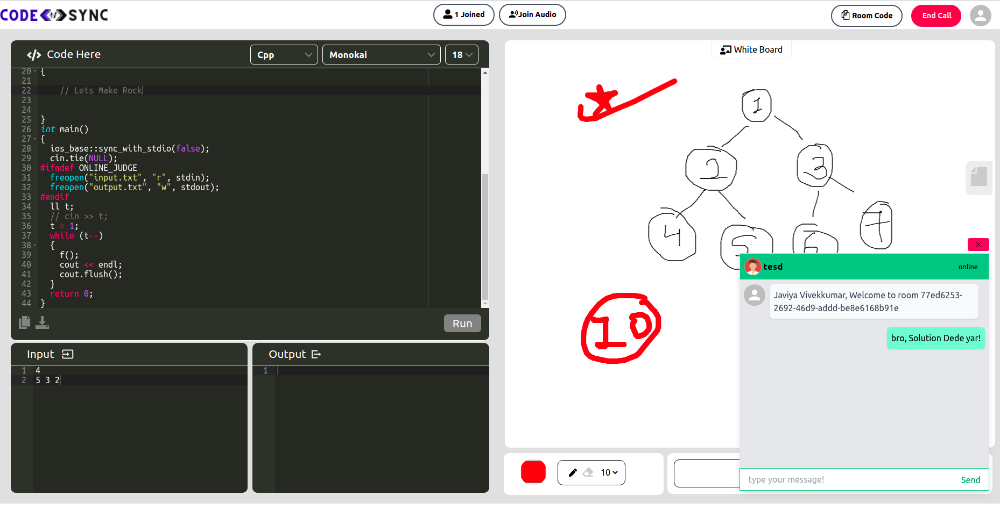

# CodeSync
### ⚠️ Site Not responsive for all screen, May you need Zoom out with chrome  🛑

[](#issues)
[](#forks)
[](#license)
<!-- https://github.com/Code-Deeper/code-sync/blob/main -->
<p align="center" width="400px"></p>
<p align="center" width="400px"> <font size="9"> <b>👨🏾‍💻 A Cloud Collebrative Platform 🧑‍🏫 </b></font></p>

CodeSync is a Cloud Collaborative Platform for Competitive programmers, Educators & who like to code with friends.CodeSync Provide  Collebrative Code-Editor,
Real-Time Audio Communication, Collaborative Drawing board for  explain idea, Collaborative text-editor for taking notes, Real-Time chat box for chatting 
with other room members & Many more things which smooth and attractive UI.
 
 ## Tech Stack 🗃
           
  
  
<!--  <br /> -->
 
## How to Setup Project In Local ? 🧑🏽‍💻
  - For Local Installation & Contribute , You can refer [Contribute.md](https://github.com/Code-Deeper/code-sync/blob/main/CONTRIBUTE.md)

## Features 📈
- [x] Collebrative Room Create & Join
- [x] Collebrative Code-Editor
- [x] Collebrative White-Board
- [x] Real Time Audio Communcation  
- [x] Real Time Chat Messaging
- [x] Collebrative Text-editor
- [x] Compiler Programe
- [ ] Invitation On Email
- [ ] Restirect User for enter room
- [ ] Add load balancer
- [ ] Template added when change language
<!--  <br/> -->
## Project Management
  - For Project Management we used Github Project section it self.You can watch [here](https://github.com/Code-Deeper/code-sync/projects/1)
  - For Any Query / Improvement You can mail on ```work.vivekjaviya@gmail.com```.
