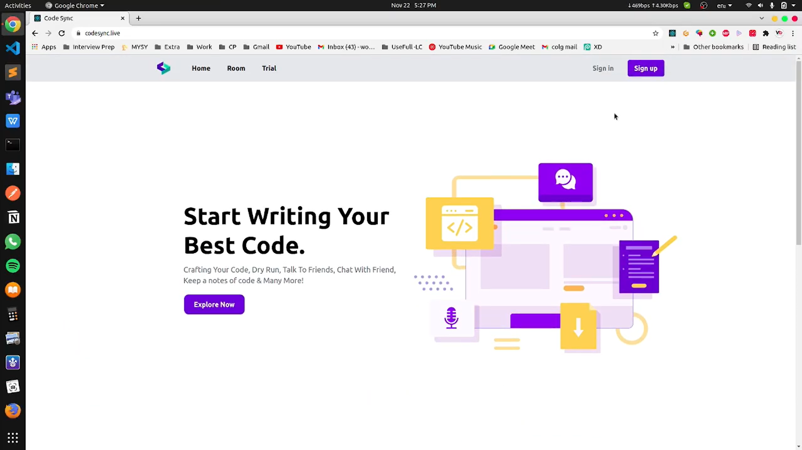
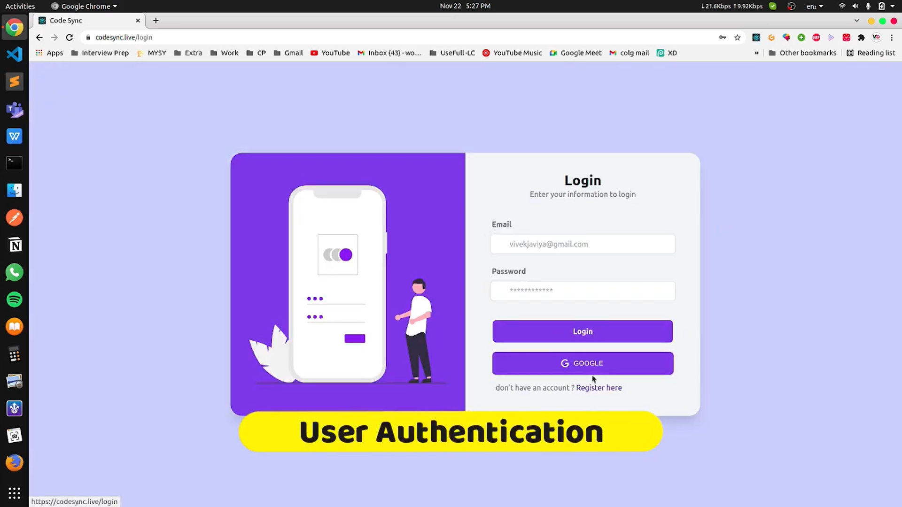
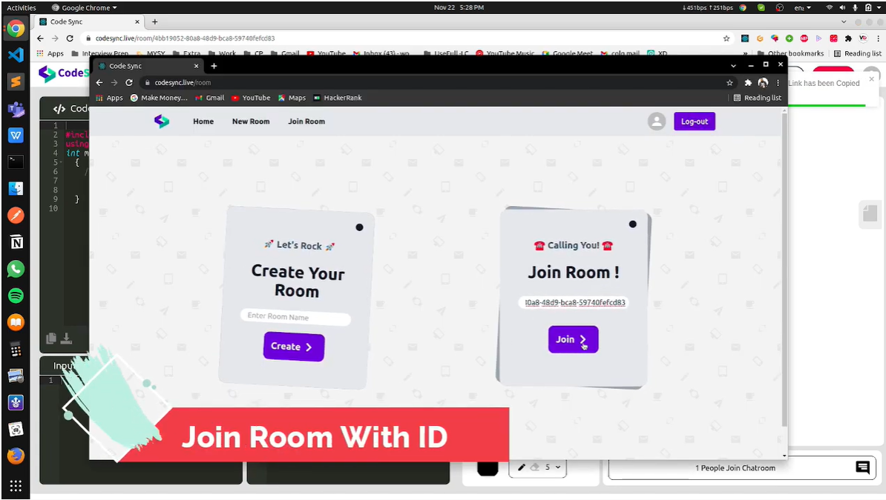
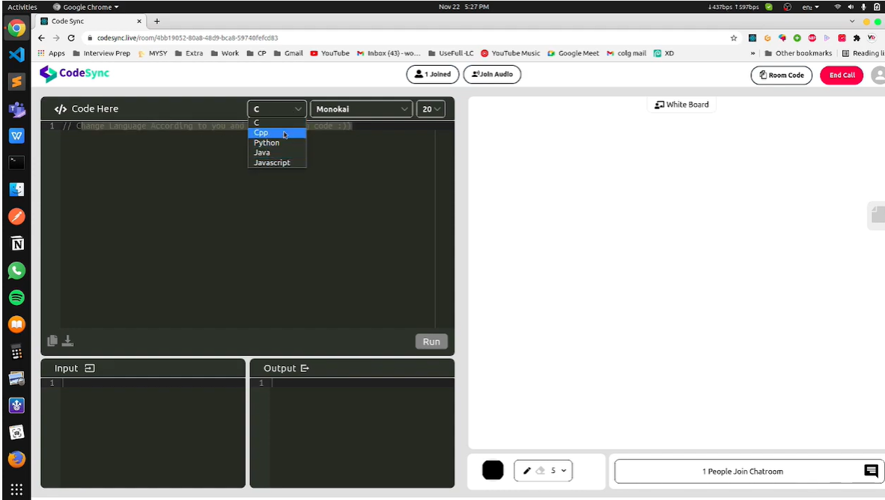
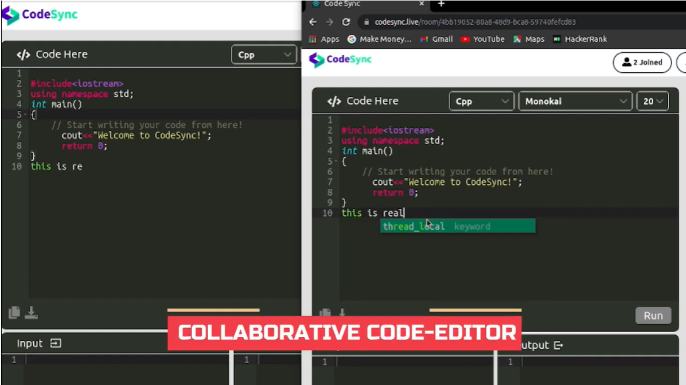
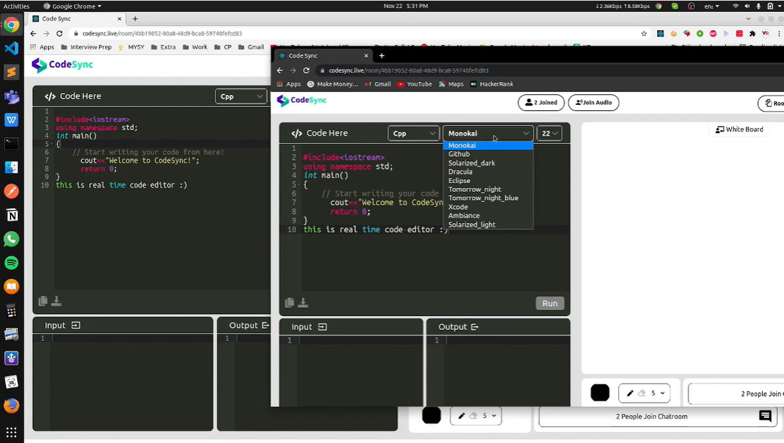
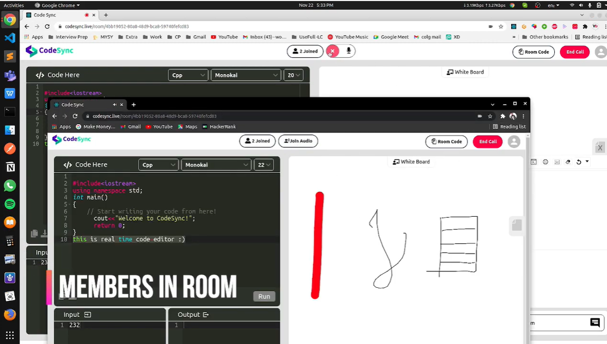
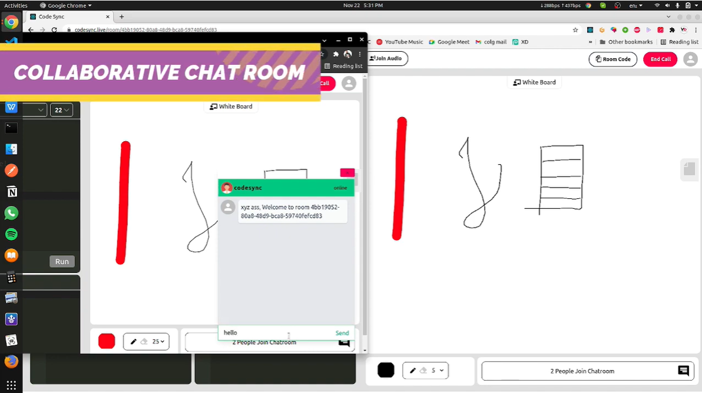
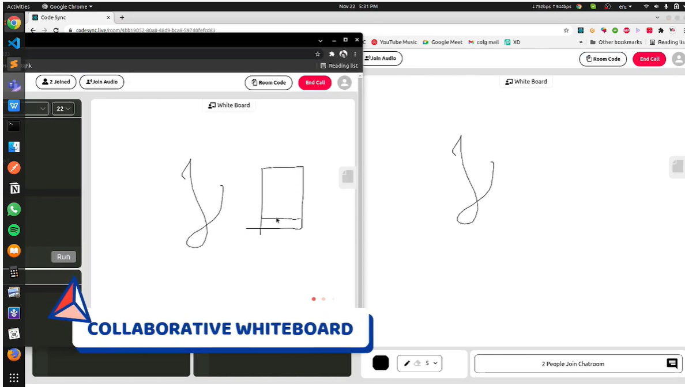

# Image Tour of entire Application☣️
  
  <h3>User Authentication 🔗</h3>
  
  <h3> Join room with ID 🂠</h3>
  
  <h3> Choose your language to code ☞</h3>
  
  <h3> Starting cool coding in the Collaborative Code-editor 📝</h3>
  
  <h3> Choose your favorite Theme ✨</h3>
  
  <h3> Work with Collaborative Text-Editor💶</h3>
  
  <h3> See the online members 👩🏻‍💻</h3>
  
  <h3> Starting using chat room 𓀃</h3>
  
  <h3> Use Collaborative White-Board for Visualization🔖</h3>
  
