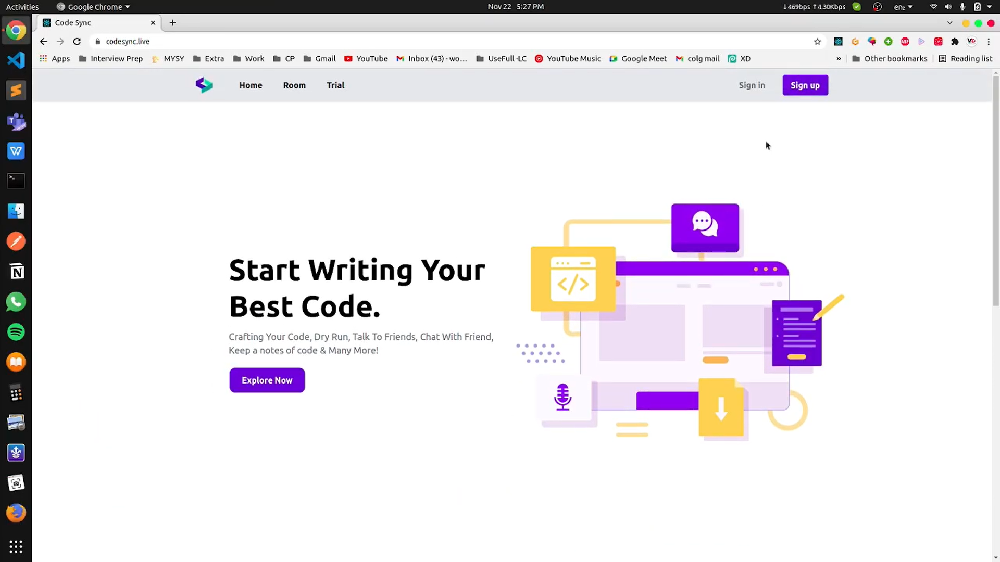
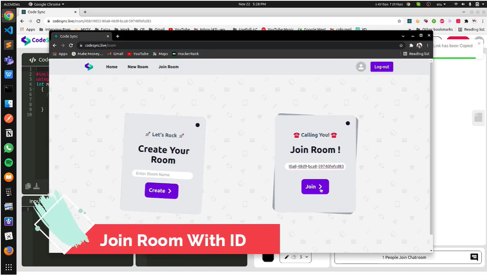
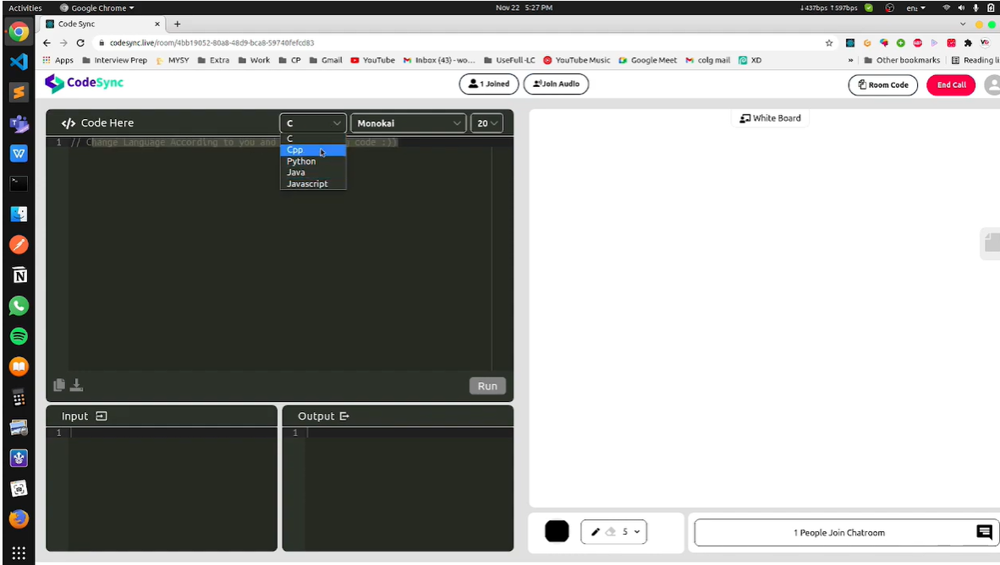
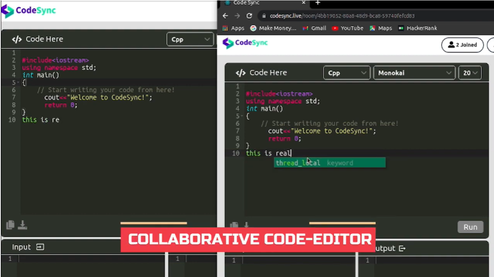
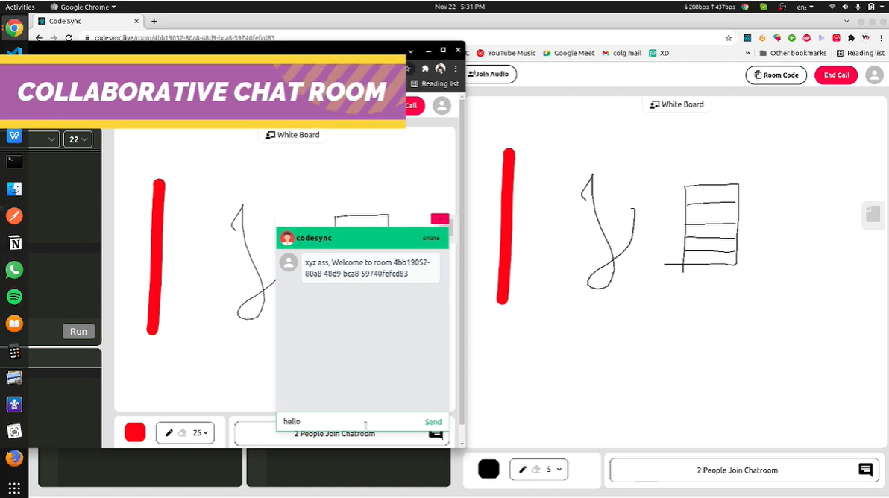
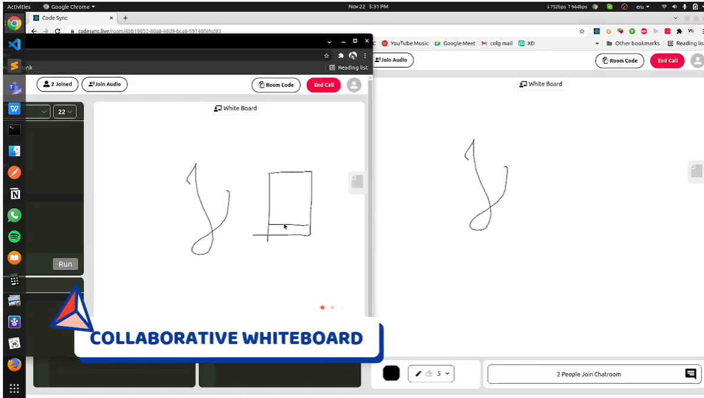

# Image Tour of entire Application☣️
<!--   -->

  <h3>1. Home-Page</h3>
  
  <h3>2. User Authentication 🔗</h3>
  
  <h3>3. Join room with ID or Create room and share the link to your peers🂠</h3>
  
  <h3>4. Choose your language to code ☞</h3>
  
  <h3>5. Starting cool coding in the Collaborative Code-editor 📝</h3>
  
  <h3>6. Choose your favorite Theme ✨</h3>
  
  <h3>7. Work with Collaborative Text-Editor💶</h3>
  
  <h3>8. See the online members 👩🏻‍💻</h3>
  
  <h3>9. Starting using chat room 𓀃</h3>
  
  <h3>10. Use Collaborative White-Board for Visualization🔖</h3>
  
  

  <h2>Hope you enjoyed, Thanks for Watching!🌻</h2>
  
